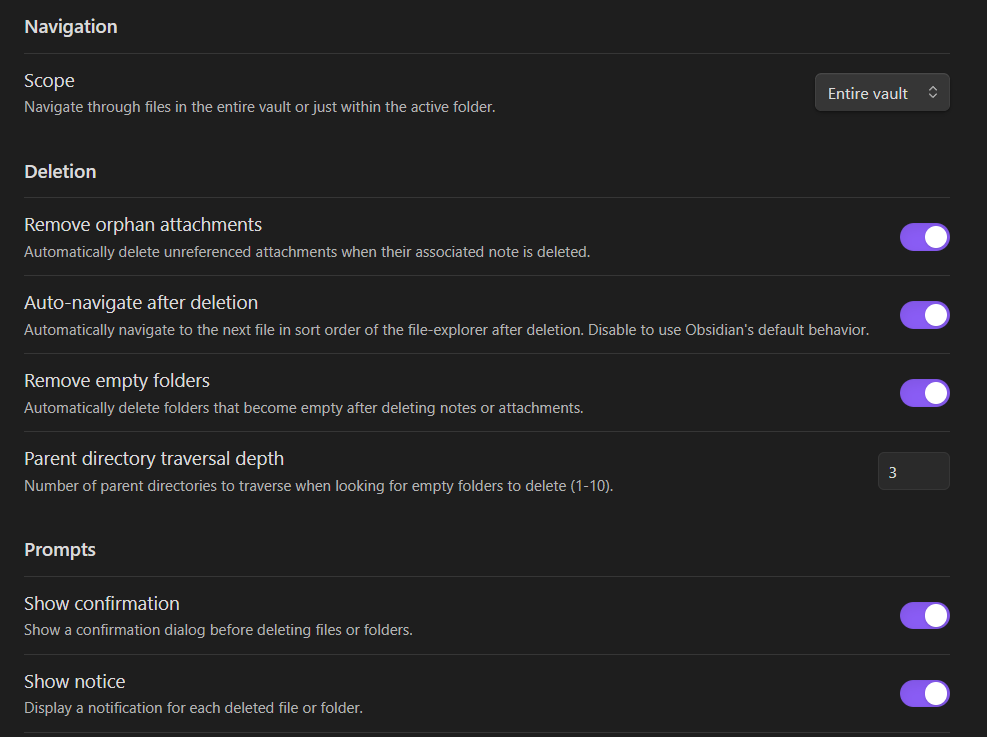

# Note Navigator Plugin
**Streamline your note review workflow with enhanced file navigation and deletion features.**

## Purpose

The "Note Navigator" plugin simplifies note review by providing file navigation commands and deletion aids. It ensures a focused review process by automatically navigating to the next logical note after deletion, making it ideal for processing temporary notes, "read it later" articles, or any collection of notes requiring cleanup.

I developed it to make navigation feel more natural after migrating from OneNote to Obsidian and it is helpful for navigating through notes made by the Obsidian Web Clipper. It may be useful for those with a folder hierarchy based set of notes (instead of heavily linked notes).

## Features

### 1. File Navigation
- Navigate to the **next** or **previous** file in the current folder or entire vault.
- Keeps track of the current sorting method used in File Explorer, whether by file name, modified date, or creation date, and supports both ascending and descending order. 

### 2. File Deletion
- Delete the current file and automatically navigate to the next file, overriding Obsidian's default behavior of navigating to the last open file.

### 3. Attachment and Folder Management
- Automatically delete **orphaned attachments** (attachments no longer referenced by any note).
- Remove **empty folders** after deleting notes or attachments.

### 4. Prompts and Notifications
- Optional **Confirmation prompt** before deleting files, with details on affected attachments and folders.
- Optional **Notification** for each deleted file.

### 5. Statistics
- Track the number of deleted files, folders, and attachments.

### 6. Scroll Past End of Note
- **Scroll past the end of the current note**: Scrolls to the end of the note and a bit further, useful when logging content to the tail of a long note.

## How to Install the Plugin

1. **Download:** Obtain the plugin files (`main.js`, `manifest.json`, `styles.css`) from the plugin's GitHub repository or the Obsidian community plugin store -- after some time it may be avaialble at https://obsidian.md/plugins?search=note-navigator.
2. **Create Plugin Folder:** Create a new folder in your Obsidian vault's plugins directory (e.g., `.obsidian/plugins/note-navigator`).
3. **Place Files:** Copy the downloaded plugin files into the newly created folder.
4. **Enable Plugin:** Open Obsidian, go to "Settings" -> "Community plugins", and enable "Note Navigator".

## Using Note Navigator "Navigate and Delete" Command

1. **Assign a Hotkey (Recommended):** Go to "Settings" -> "Hotkeys" and search for "note navigator" to see the plugin commands. Assign a hotkey combination (e.g., `Ctrl+Alt+D` or `Cmd+Option+D`) for easy access.
2. **Configure Settings:** Adjust plugin settings to match your workflow. You may want to show confirmations the first few times you use it, and then once you're comfortable with how it works, you can hide the confirmation prompts.
3. **Open a Note:** Open the note you want to review and potentially delete.
4. **Execute the Command:** Use the assigned hotkey (or the command palette) to execute the "Navigate and Delete" command.
5. **Confirmation (Optional):** If enabled, a dialog box will appear asking you to confirm the deletion.
6. **Navigation:** The current note will be deleted, and the plugin will automatically navigate to the next note based on the selected sort order and scope.

## Settings

### Navigation
- **Navigation Scope:** Choose between navigating within the **entire vault** or the **active folder**.

### Deletion Behavior
- **Remove Orphan Attachments:** Toggle automatic deletion of unused attachments.
- **Remove Empty Folders:** Toggle automatic deletion of empty folders.

### Prompts
- **Show Confirmation:** Enable or disable confirmation prompts before deletion.
- **Show Notice:** Enable or disable notifications for deleted files.

### Statistics
- View counters for deleted files, folders, and attachments.
- Reset counters with a single button.

## Commands
The plugin provides the following commands:
- **Delete current file and navigate to next note:** Deletes the active file and navigates to the next file.
- **Navigate to next file:** Navigate to the next file in the current folder or vault.
- **Navigate to previous file:** Navigate to the previous file in the current folder or vault.
- **Move current file and navigate to next note:** Opens the move dialog for the current file, and automatically navigates to the next file in the chosen sort order and scope.
- **Log debugging messages to console:** Outputs debugging information about sorting and deletion methods. Open the console to review these messages.
- **Scroll past end of note:** Instantly scrolls to the end of the current note and a bit further.
- **Rename parent folder of current note:** Opens a dialog to rename the parent folder of the currently active note.

---

Note: The plugin's functionality is triggered only through its commands and does not override Obsidian's default delete behavior.

